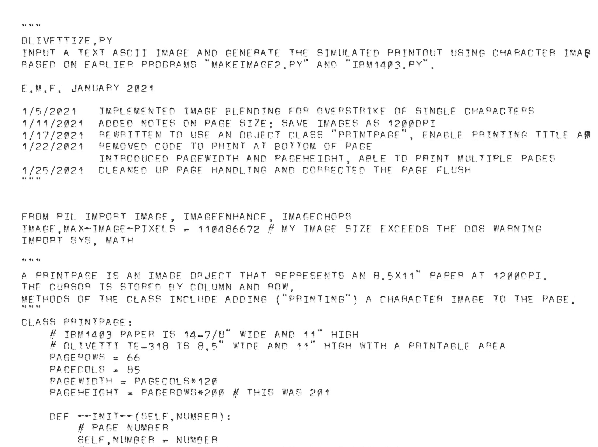

# Olivettize
Render text like an Olivetti Te-318 teleprinter! But without the hearing loss!

`python3 olivettize.py file.txt` will create `file.pdf`

Olivettize will read the text file and generate 8.5x11" 600 dpi images, which are wrapped together into a PDF. The `chars` directory contains images of the printed Olivetti type. Four complete sets are used to provide a modest degree of variability. Like a physical teleprinter using continuous feed paper, Olivettize prints down the entire length of the page; however, it is exquisitely aligned such that one never prints over the perforation (future feature).

Requires Python3.X and the [Pillow image library](https://pillow.readthedocs.io/en/stable/index.html).

Read more about the Olivetti Te-318 [here](http://ef1j.org/wiki/index.php?n=Main.OlivettiTE-318). The Olivetti communicates using the 64 characters of ASCII-63, so underscore, tilde, carat, curly brackets, and a few other characters don't exist. Nor does lowercase.

The contents of this repository are published under the MIT license.

